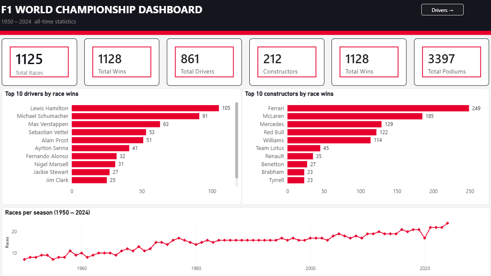
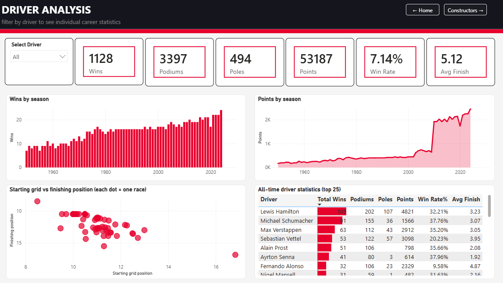
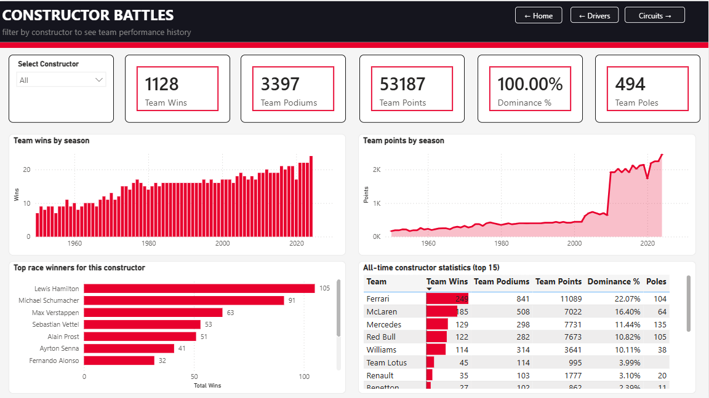
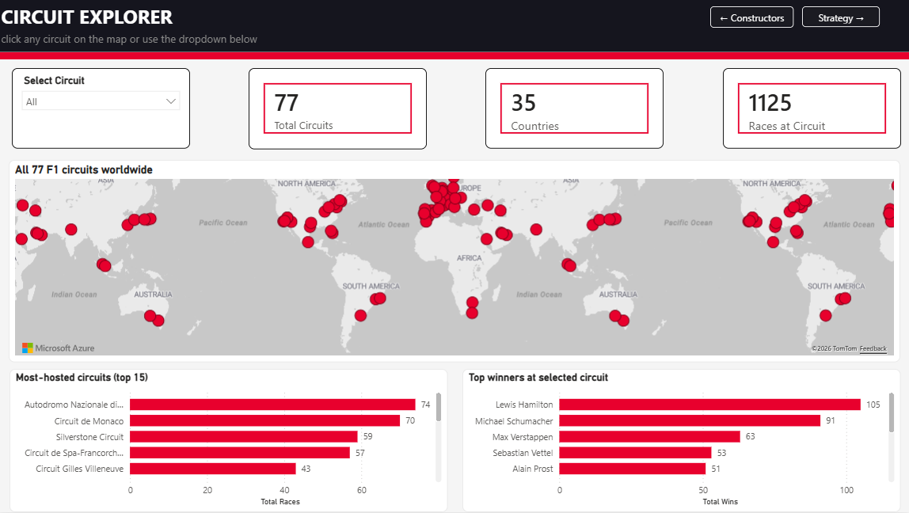
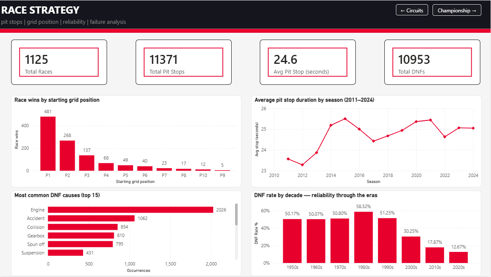
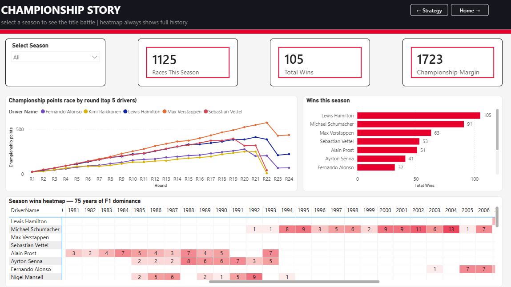
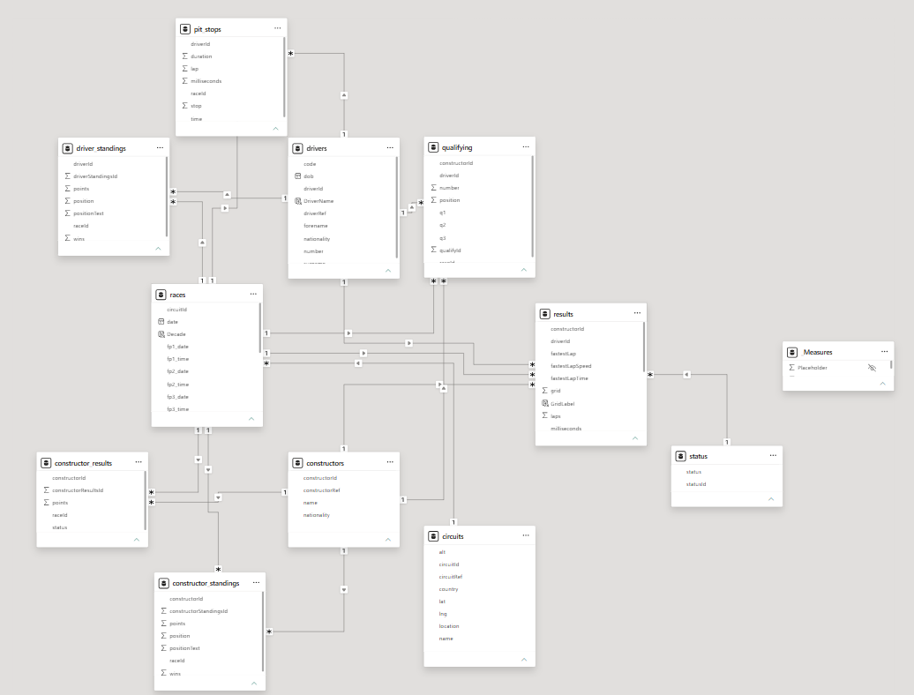

# 🏎️ F1 World Championship Dashboard

An interactive **6-page Power BI dashboard** analyzing 75 years of Formula 1 data (1950–2024). 
Built to demonstrate data modeling, DAX, and analytical storytelling skills for a data analytics portfolio.

---

## 📊 Dashboard Pages

| Page | Description |
|------|-------------|
| **Home Overview** | KPI headline cards, top 10 drivers/constructors, races-per-season trend |
| **Driver Analysis** | Career stats, wins by season, grid vs finish scatter, all-time comparison table |
| **Constructor Battles** | Team performance history, driver contributions, constructor dominance % |
| **Circuit Explorer** | World map of 77 circuits, most-hosted tracks, top winners by circuit |
| **Race Strategy** | Grid position win rates, pit stop trends, DNF causes, reliability by decade |
| **Championship Story** | Season title battle by round, wins heatmap across all 75 years |

---

## 🖼️ Screenshots

### Home Overview

### Driver Analysis

### Constructor Battles

### Circuit Explorer

### Race Strategy

### Championship Story

---

## 🗄️ Data Model

The project uses a star schema with 11 interconnected tables from the Ergast F1 dataset.

**Core fact table:** `results` (~25,000 rows)  
**Dimension tables:** `drivers`, `constructors`, `circuits`, `races`, `status`  
**Supporting tables:** `driver_standings`, `constructor_standings`, `qualifying`, `pit_stops`, `constructor_results`

---

## 📐 Technical Skills Demonstrated

- **Data modeling** — Star schema with 16 relationships, correct cardinality
- **DAX measures** — 20+ measures including time intelligence, CALCULATE, DIVIDE, MAXX, ALLSELECTED, SWITCH
- **Power Query** — Data cleaning, type conversion, \N null handling, calculated columns
- **Visualization** — 6 distinct page layouts, world map, scatter plot, heatmap matrix, area charts
- **UX design** — Page navigation buttons, cross-page slicer interactions, Edit Interactions

---

## 📁 Dataset

**Source:** [Formula 1 World Championship (1950–2024)](https://www.kaggle.com/datasets/rohanrao/formula-1-world-championship-1950-2020) by Rohan Rao on Kaggle

14 CSV files covering every F1 race, driver, constructor, circuit, lap time, and pit stop since 1950.

---

## 🚀 How to Use

1. Download `F1_World_Championship_Dashboard.pbix` from this repository
2. Open with [Power BI Desktop](https://powerbi.microsoft.com/desktop) (free)
3. Data is embedded — no additional setup required
4. Use the navigation buttons on each page to move between sections
5. Use slicers to filter by driver, constructor, circuit, or season

---

## 🛠️ Built With

- **Power BI Desktop** (free)
- **DAX** (Data Analysis Expressions)
- **Power Query M**
- **Dataset:** Ergast F1 API via Kaggle

---

## 👤 About

Built as a portfolio project demonstrating data analytics and business intelligence skills.  
